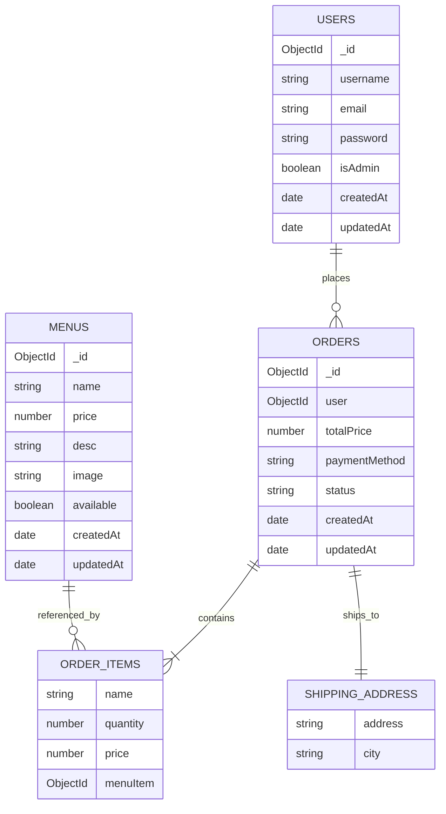

# Revised Database Design Diagram

```mermaid
erDiagram
  USERS {
    ObjectId _id
    string username
    string email
    string password
    boolean isAdmin
    date createdAt
    date updatedAt
  }

  MENUS {
    ObjectId _id
    string name
    number price
    string desc
    string image
    boolean available
    date createdAt
    date updatedAt
  }

  ORDERS {
    ObjectId _id
    ObjectId user
    number totalPrice
    string paymentMethod
    string status
    date createdAt
    date updatedAt
  }

  ORDER_ITEMS {
    string name
    number quantity
    number price
    ObjectId menuItem
  }

  SHIPPING_ADDRESS {
    string address
    string city
  }

  USERS ||--o{ ORDERS : places
  ORDERS ||--|{ ORDER_ITEMS : contains
  MENUS ||--o{ ORDER_ITEMS : referenced_by
  ORDERS ||--|| SHIPPING_ADDRESS : ships_to
```

